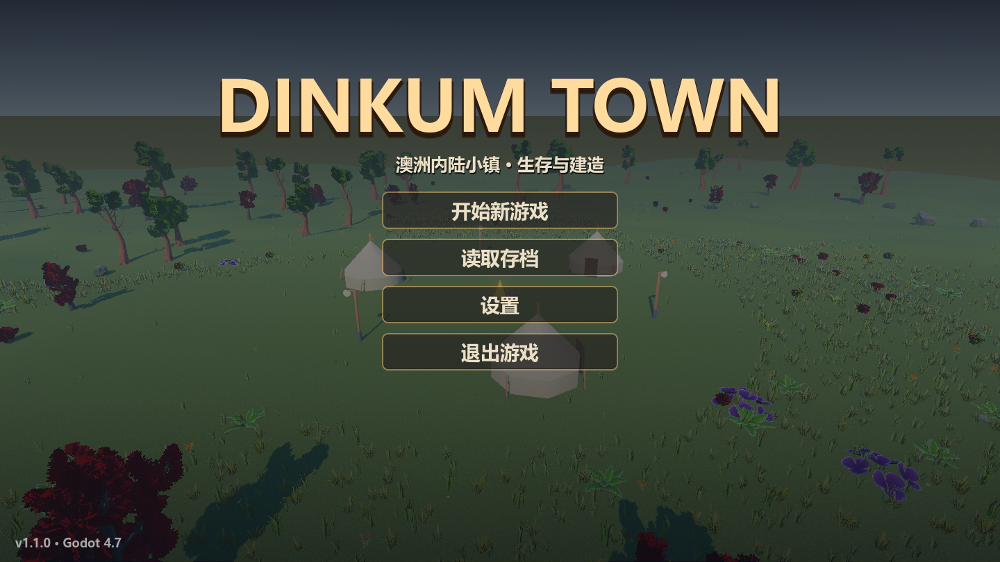

# DinkumTown3D

Godot 4.7.2 第三人称小镇游戏，支持采集、建造、农耕、狩猎、昼夜季节、游泳与潜水。无需安装 addons。

## 下载与安装（v1.1.0）

[最新 GitHub Release](https://github.com/Eser-Tired/DinkumTown3D/releases/latest) · [v1.1.0 发布说明](https://github.com/Eser-Tired/DinkumTown3D/releases/tag/v1.1.0)

| 下载 | 平台 | 安装方式 |
|---|---|---|
| [Windows EXE](https://github.com/Eser-Tired/DinkumTown3D/releases/download/v1.1.0/DinkumTown3D-Windows-x64.exe) | Windows 10/11，x64 | 单文件免安装，下载后双击 |
| [Android APK](https://github.com/Eser-Tired/DinkumTown3D/releases/download/v1.1.0/DinkumTown3D-Android.apk) | 64 位 ARM / x86，建议 Android 9 及以上 | 允许浏览器或文件管理器安装未知应用，再安装 APK |
| [SHA256SUMS.txt](https://github.com/Eser-Tired/DinkumTown3D/releases/download/v1.1.0/SHA256SUMS.txt) | 文件校验 | PowerShell：`Get-FileHash 文件路径 -Algorithm SHA256` |

安装包已经包含全部游戏模型、动画、材质与贴图，不需要安装 Godot。Windows 使用 Forward+，安卓使用 Mobile 渲染器，需要兼容的显卡 / Vulkan 驱动；大量植被的帧率与手机温度尚未做真机测试。[引擎硬件要求](https://docs.godotengine.org/en/stable/about/system_requirements.html)

**安卓旧版升级：** v1.0.0 的签名密钥已丢失，v1.1.0 使用新的固定专属发布密钥，不能覆盖安装 v1.0.0。旧版用户需先卸载再安装；卸载通常会删除旧存档。后续版本继续使用本次密钥并递增版本号。APK 包名为 `com.dinkumtown3d.app`，横屏游玩。

Windows EXE 未做商业代码签名，首次打开可能出现 SmartScreen 提示。游戏存档与设置写入 Godot 的用户数据目录，Windows 默认为 `%APPDATA%\Godot\app_userdata\Dinkum Town 3D\`，与 EXE 所在位置无关。



## 从源码运行

克隆本仓库，用 Godot 4.7.2 打开 `project.godot`，按 F5 启动游戏。主场景是主菜单。Windows 启动脚本需要本机 Godot 位于相邻的 `../Tools/Godot/Godot.exe`。

所有运行时模型、骨骼动画、材质和贴图都已放入 `assets/` 并随 Git 提交。无需 Git LFS、资源安装脚本或另外下载素材。`.godot` 是可重建缓存，截图临时目录和个人存档不属于运行依赖。

## 操作

| 操作 | 键盘 / 鼠标 |
|---|---|
| 移动 / 跑步 / 跳跃 | WASD 或方向键 / Shift / 空格 |
| 视角 / 相机距离 | 按住右键拖动 / 滚轮 |
| 攻击 / 切换武器 | 左键（非建造模式）/ Q |
| 采集 / 农事与交互 | E / F |
| 背包 / 建造 / 旋转 | I 或 Tab / B / R |
| 切换作物 / 存档 / 读档 | G / F2 / F3 |
| 下潜 / 暂停 / 帮助 | 水中 Ctrl 或 C / Esc / H |

手机使用左下摇杆移动、空白区域拖动视角、双指捏合缩放，以及屏幕上的动作与快捷栏按钮。界面随分辨率自动缩放；设置可调整画质及摇杆布局。

人物步行 / 跑步速度为 1.8 / 5.2 米每秒，骨骼步频随碰撞后实际速度变化；站立用自然待机，顶墙时停止走路动画。动物转弯沿身体朝向前进。

## 素材与许可

自然、人物、动物来自 Quaternius；房屋、家具、容器与道具来自 Kenney，第三方源素材均为 CC0，原始许可保留在 `assets/` 各目录。地形、水、UI、作物及地表贴图由项目生成。旧 EmacE 资源已退役：历史文档和导入工具仅供记录，当前游戏不读取 `local_assets/`。

[素材说明](docs/nature_assets.md) · [本轮动作与完整交付验收](docs/motion_delivery.html)

Godot 引擎使用 MIT 许可；引擎及其第三方依赖声明位于 `assets/engine/`，也随运行包交付。第三方素材许可不等于本仓库自有代码的授权。

## 重新打包

1. 安装 Godot **4.7.2** 及对应导出模板。安卓配置 JDK 和 Android SDK 路径；本次构建使用 JDK 25、SDK Build-Tools 35.0.1 与官方预编译 APK 模板，无需 addons / Gradle 插件。
2. 为安卓准备固定的发布 keystore；密钥与密码必须放在仓库外，并另行安全备份。更换密钥会破坏覆盖升级。
3. 通过官方环境变量 `GODOT_ANDROID_KEYSTORE_RELEASE_PATH`、`GODOT_ANDROID_KEYSTORE_RELEASE_USER`、`GODOT_ANDROID_KEYSTORE_RELEASE_PASSWORD` 注入签名后执行：

```powershell
./tools/build_release.ps1 -GodotPath 'C:/Tools/Godot/Godot_console.exe'
```

也可传入仓库外的 `-SigningConfigPath` JSON 文件，字段为 `keystore`（密钥路径）、`alias`（别名）、`password`。不要把该文件或 keystore 上传到 GitHub。本机固定密钥与配置保存在 `%USERPROFILE%\.android\dinkumtown3d-release\`。

产物位于 `build/`：Windows 单文件 EXE、含 arm64-v8a 与 x86_64 的签名 APK，以及 SHA-256 校验文件。构建使用 Release 模板；导出排除 `docs/`、`tools/`，保留所有动态加载的美术资源及许可文本。二进制通过 Release 附件分发，`build/` 不进入源码 Git。

完整配置见 [export_presets.cfg](export_presets.cfg)，安卓环境与签名要求见 [Godot 官方文档](https://docs.godotengine.org/en/stable/tutorials/export/exporting_for_android.html)。发布前还应运行下列验收，并用 SDK 的 `apksigner verify --verbose --print-certs` 检查 APK。

## 验证

逻辑测试用 `Godot --headless --path . res://tools/<主题>_check.tscn --fixed-fps 60`。涉及存档的测试应在修改了 `config/name` 的独立检出中运行。`nature_check` 与截图脚本需要窗口模式；`delivery_check.gd` 和 `art_dependencies.gd` 用 `--script` 执行。

当前交付包含 119 个资产场景；验收覆盖待机恢复、完整步态、转弯、实体碰撞、进出房屋、读档、水域和 8 种触控分辨率。

**v1.1.0 验证范围：** 战斗 102 项、水域 38 项、UI 1907 项与存档往返全绿；8 种触控分辨率 `bad=0`。Windows EXE 实际启动截图通过；Windows / APK 运行资源审计均覆盖 119 场景、19 独立贴图、147 贴图表面和随包许可。APK 的 v2 / v3 签名验证通过，但没有连接安卓真机，模拟器因缺少硬件加速无法启动，未完成安卓安装及真机性能验收。部分测试仍有退出时 ObjectDB 清理警告。

[运行包检查](tools/release_check.gd) 用相同版本的 Godot 编辑器执行 `--main-pack 导出文件 --script 本脚本的绝对路径`。Android APK 可先把 ZIP 中的 `assets/` 内容去掉前缀后重新打成 ZIP，再用 `--main-pack` 审计。窗口模式的 [运行包冒烟检查](tools/release_smoke.gd) 覆盖菜单、开始新游戏与实际移动，可通过 `-- --out 截图目录` 保存画面。Release 模板禁止外部脚本及场景路径覆盖，因此这两项通过编辑器加载真实导出资源完成；不能据此声称 APK 已在安卓设备运行。
