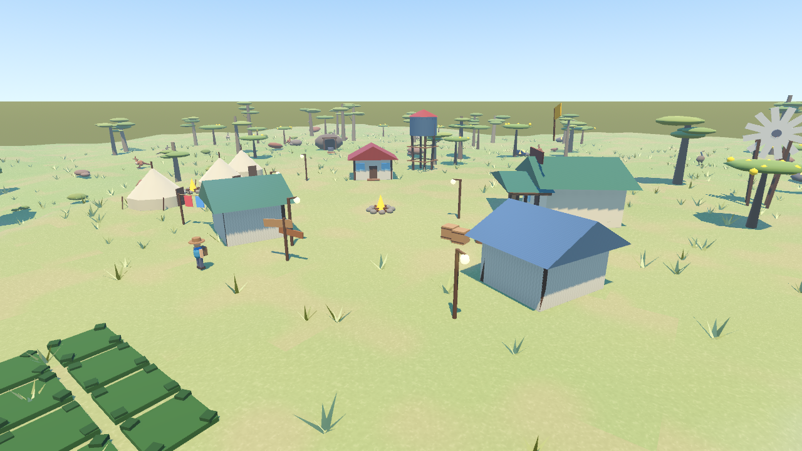
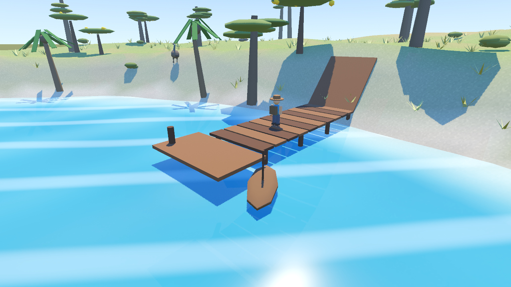

# 材质与物理第一版

保持原有低多边形色板，给木材、树皮、铁皮、帆布、石头和墙面增加细节。颜色纹理与法线纹理在首次使用时生成并缓存，每种表面为 128×128，带 mipmaps 和三平面投射，不需要外部素材。地面增加草土斑块、颗粒、坡面石色和岸边湿色；雨天逐渐变湿，晴天逐渐干燥。水面法线使用正确的视空间转换，并加入浅岸泡沫。

角色现在通过胶囊碰撞、重力和 `move_and_slide()` 移动。地形碰撞来自渲染地形网格；建筑、树干、岩石使用实体碰撞，动物有随主体移动的碰撞体。小台阶可直接跨过，高墙需要绕行。建造预览没有实体碰撞，正式放置后启用。

## 如何体验

- WASD/方向键移动，Shift 奔跑，空格跳跃；触屏移动和跳跃也沿用原有控件。
- 镇内原木箱堆改为两只木箱和一只木桶：向它们持续走动即可推动。
- 沿岸边坡道走上码头，走到边缘落水后进入游泳；Ctrl/C 和触屏「潜」继续下潜。
- 湖中有两段漂木。砍树后也会留下可滚动的木段；采集资源仍立即入包，木段不重复发资源。
- 保存后再读档，木箱、木桶和木段恢复位置、旋转、线速度、角速度和休眠状态。角色恢复位置与垂直运动，避免空中读档丢失落体速度。旧存档缺少新字段时继续正常加载。

## 文件与参数

| 文件 | 内容 |
| --- | --- |
| `scripts/materials.gd` | 材质缓存、纹理生成、法线和粗糙度 |
| `shaders/ground.gdshader` | 地面细节与湿润度 |
| `scripts/terrain.gd` | 地形碰撞、水面和天气湿润 |
| `scripts/world_collision.gd` | 正式世界物体的简化碰撞，连续码头甲板 |
| `scripts/player.gd` | 胶囊移动、重力、跳跃、28 厘米低台阶、推动和游泳 |
| `scripts/physics_prop.gd` | 动态道具、摩擦、阻尼、三点浮力和状态存储 |
| `scripts/main.gd` | 道具生成、码头坡道、放置碰撞和存读档接入 |

动态道具总数限制为 24；达到上限后优先回收最早的木段，保留已推动的木箱。浮力只用于木段，按三个采样点的浸水比例施力并增加水中阻尼。水面仍是着色器效果；小船保留原有装饰动画，尚未加入驾驶或刚体浮力。

## 与最新 main 合并

已接入 main 的 `6a86676`（房屋进入、床边睡觉、音效、跳跃姿态与触控布局修复）。室内地板、墙面和家具增加实体碰撞；帐篷布墙采用空心分段碰撞，避免圆筒碰撞体堵住室内。角色在室内使用室内边界与地板参考，进出房屋清除旧速度，保留 main 的镜头距离和跳跃姿态。室内保存时继续写门外落点，并清除室内跳跃速度。脚步音高使用固定物理帧的真实水平速度。

## 验证

在更改 `application/config/name` 的独立项目副本中运行测试，以隔离真实 `user://` 存档。使用 Godot 4.7.2，固定 60 Hz：

```powershell
$engine = '你的 Godot 可执行文件路径'
$validationPath = '独立验证副本的绝对路径'
& $engine --headless --editor --path $validationPath --quit
& $engine --headless --path $validationPath --fixed-fps 60 res://tools/physics_check.tscn --quit-after 2400
& $engine --headless --path $validationPath --fixed-fps 60 res://tools/interior_check.tscn --quit-after 6000
& $engine --headless --path $validationPath --fixed-fps 60 res://tools/water_check.tscn --quit-after 2400
& $engine --headless --path $validationPath --fixed-fps 60 res://tools/combat_check.tscn --quit-after 2400
& $engine --headless --path $validationPath --fixed-fps 60 res://tools/e2e.tscn --quit-after 2400
```

结果：物理 23/23、水域 37/37、战斗与界面 102/102，室内进出、睡觉和存读档端到端测试通过。室内回归新增真实落地、跳跃、家具阻挡与室内存档速度断言。必须核对日志中的 `DONE` 和 `fails=0`，不能只判断退出码，因为解析错误或超时退出也可能返回 0。

实际截图通过 `tools/materials_shot.tscn` 在 Forward+ 下生成；第一版的 Forward Mobile 也完成材质编译与截图，但尚未在安卓实机验证。Mobile 渲染器仍提示原有 SSAO 设置不受支持。截图工具隐藏界面、固定地图种子和日照时间，游戏界面不受影响。该工具也支持 `-- --dir <输出目录>`。合并后复核材质、室内和跳跃截图。触控布局在 1440×810、1280×720、1920×1080、2560×1440、720×1280、810×1440、1080×1920、1440×2560 八种分辨率下全部 `bad=0`；此前的竖屏「农事」按钮重叠由 main 的布局修复解决。




